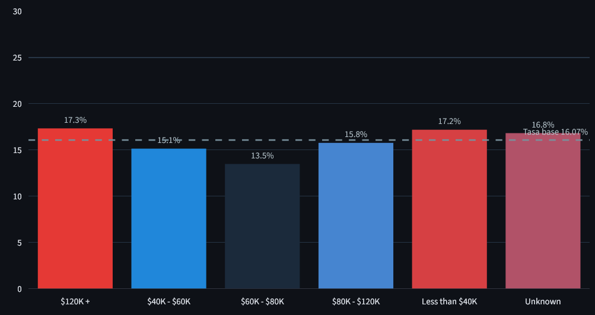
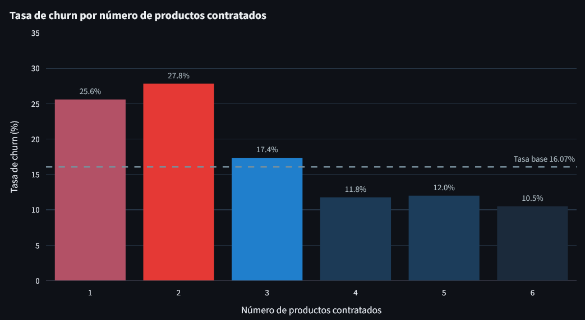
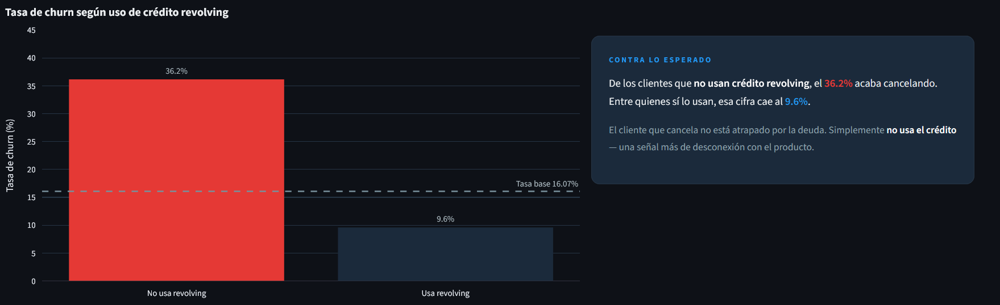
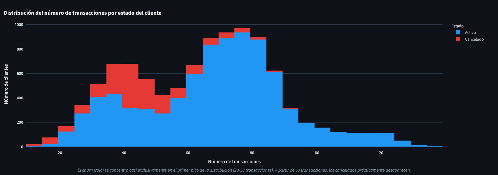
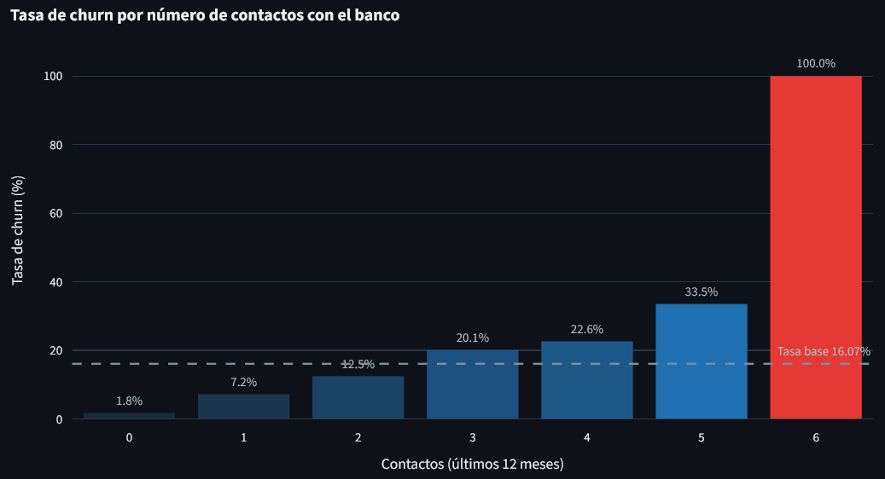
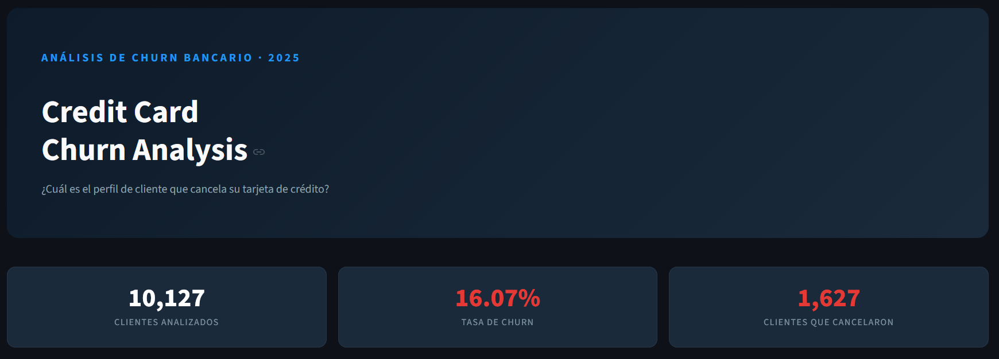
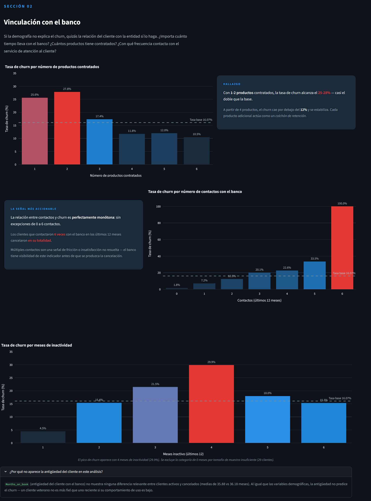
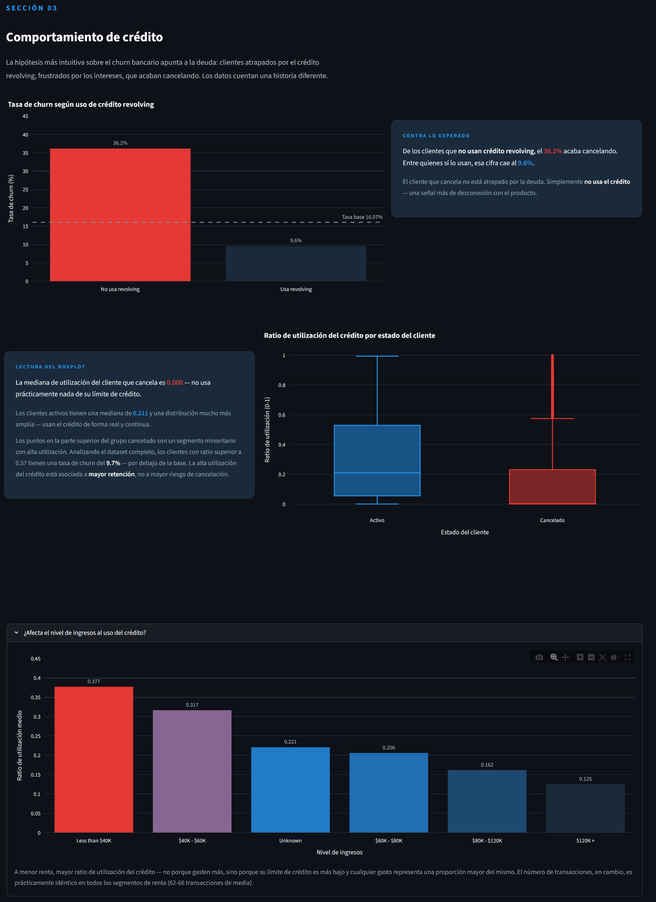
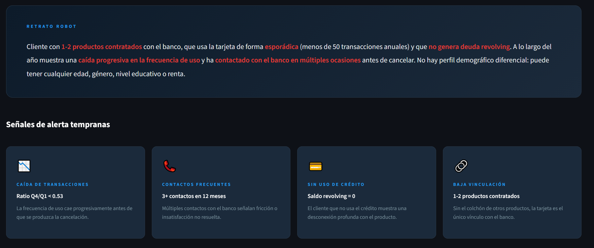

# 💳 Credit Card Churn Analysis (https://creditcardchurners.streamlit.app/)
> Análisis exploratorio de datos para identificar el perfil de cliente bancario que cancela su tarjeta de crédito.

---

## 📌 El problema

**¿Cuál es el perfil de cliente que cancela su tarjeta de crédito?**

La cancelación de tarjetas de crédito supone una pérdida directa de ingresos para las entidades bancarias. Identificar con antelación qué clientes tienen mayor riesgo de abandono permite al banco intervenir de forma proactiva — a través de ofertas personalizadas, mejora del servicio o estrategias de cross-selling — antes de que se produzca la cancelación efectiva.

Este proyecto no construye un modelo predictivo, sino que responde a una pregunta más fundamental: **¿qué características y comportamientos distinguen a los clientes que cancelan de los que permanecen?**

---

## 📊 Los datos

**Fuente:** [Credit Card Customers — Kaggle](https://www.kaggle.com/datasets/sakshigoyal7/credit-card-customers)

| | |
|---|---|
| **Filas** | 10,127 clientes |
| **Columnas originales** | 23 |
| **Columnas tras limpieza** | 22 (tras eliminar identificadores y columnas de Naive Bayes) |
| **Variable objetivo** | `Attrition_Flag` — 0 (cliente activo) / 1 (cliente cancelado) |
| **Tasa de churn** | 16.07% (1,627 clientes cancelados) |

Cada fila representa un cliente único con información demográfica (edad, género, nivel educativo, estado civil, nivel de ingresos), de vinculación con el banco (antigüedad, número de productos, inactividad, contactos) y de comportamiento transaccional y crediticio (transacciones, importes, límite de crédito, saldo revolving).

---

## 🔧 El proceso

### Preprocesamiento (`notebooks/01_preprocessing.ipynb`)

**Limpieza y tipado:**
- Eliminación de las dos columnas `Naive_Bayes_Classifier_*` — salidas de un clasificador previo que introducen *data leakage* sobre la variable objetivo.
- Eliminación de `CLIENTNUM` — identificador sin valor analítico.
- Conversión de `Attrition_Flag` y `Gender` a binario (0/1).
- Conversión de `Education_Level`, `Income_Category` y `Card_Category` a `Categorical` ordenable — permite preservar la jerarquía real de cada variable.
- Conversión de `Marital_Status` a `Categorical` no ordenable.

**Tratamiento de outliers:**
- Se optó por **IQR** como método principal para variables con distribuciones asimétricas o no normales (la mayoría de variables financieras y transaccionales).
- Se usó **Z-score** exclusivamente para `Customer_Age`, la única variable con distribución unimodal y simétrica confirmada.
- Variables discretas acotadas (`Total_Relationship_Count`, `Dependent_count`, `Contacts_Count_12_mon`, `Months_Inactive_12_mon`) fueron excluidas del análisis de outliers por definición — su rango natural no permite valores genuinamente atípicos.
- Investigación específica de `Months_on_book` (pico artificial en 36 meses, 24.3% del dataset — descartado como error tras verificar coherencia demográfica) y `Total_Revolving_Bal` (pico legítimo en 0 — verificado mediante coherencia con `Avg_Utilization_Ratio`).
- `Total_Trans_Amt` se identificó como distribución **trimodal** con tres grupos separados por huecos reales — ningún valor fue tratado como outlier.
- Para variables con skew alto (`Avg_Open_To_Buy`, `Credit_Limit`), se recalculó con `k=3*IQR` confirmando que los valores extremos eran clientes legítimos de alto perfil, no errores.

**Nuevas columnas creadas:**
- `Avg_Trans_Amt` — importe medio por transacción (distingue frecuencia de magnitud de gasto).
- `Activity_Segment` — segmentación en Low/Medium/High basada en los tres grupos naturales de `Total_Trans_Amt`.
- `Revolving_Use` — indicador binario de uso de crédito revolving.

---

## 🔍 Hallazgos clave

### 1. El perfil demográfico no predice el churn

Ninguna variable demográfica (edad, género, nivel educativo, estado civil, nivel de ingresos) supera los 5 puntos de diferencia respecto a la tasa base del 16.07%. El cliente que cancela no tiene un perfil sociodemográfico diferencial — puede tener cualquier edad, género o renta.

> 

---

### 2. La baja vinculación con el banco multiplica el riesgo

Con 1-2 productos contratados, la tasa de churn alcanza el **25-28%** — casi el doble de la base. A partir de 4 productos cae por debajo del 12%. Cada producto adicional contratado actúa como un factor de retención.

> 

---

### 3. Contra lo esperado: quien no debe, cancela

Solo el **9.6%** de los clientes que usan crédito revolving cancela, frente al **36.2%** de quienes no lo usan. El cliente que cancela tiene saldo revolving mediano de $0 y ratio de utilización mediano de 0.000. No es un cliente atrapado por la deuda — es un cliente desconectado del producto.

> 

---

### 4. El número de transacciones es el predictor más fuerte (-0.37)

Los clientes que cancelan realizan una mediana de **43 transacciones anuales** frente a **71** en clientes activos. El histograma apilado muestra que el churn se concentra casi exclusivamente en el primer pico de la distribución bimodal (20-50 transacciones) y prácticamente desaparece a partir de 60. Además, el cliente que cancela **reduce progresivamente su frecuencia de uso** a lo largo del año (ratio Q4/Q1: 0.531 vs 0.721).

> 

---

### 5. Los contactos con el banco son la señal más accionable

La relación entre número de contactos y churn es perfectamente monótona: de **1.8%** con 0 contactos hasta **100%** con 6 contactos, sin una sola excepción. Los clientes que contactan repetidamente con el banco muestran fricción o insatisfacción no resuelta — y el banco tiene visibilidad de este indicador **antes** de que se produzca la cancelación.

> 

---

## 🚀 Cómo ejecutar el proyecto

### Requisitos previos

```bash
# Clonar el repositorio
git clone https://github.com/tu_usuario/Credit_Card_Churners.git
cd Credit_Card_Churners

# Crear y activar entorno virtual
python -m venv .venv
.venv\Scripts\activate        # Windows
source .venv/bin/activate     # macOS/Linux

# Instalar dependencias
pip install -r requirements.txt
```

### Notebooks de análisis

```bash
# Abrir Jupyter
jupyter notebook

# Ejecutar en este orden:
# 1. notebooks/exploration.ipynb      — carga y exploración inicial del dataset
# 2. notebooks/preprocessing.ipynb   — limpieza y preprocesamiento
# 3. notebooks/eda.ipynb             — análisis exploratorio
```

### Aplicación Streamlit

```bash
streamlit run app/app.py
```

La app se abrirá automáticamente en `http://localhost:8501`

---

## 📁 Estructura del repositorio

```
Credit_Card_Churners/
├── data/
│   ├── raw/
│   │   └── BankChurners.csv          # Dataset original de Kaggle
│   └── processed/
│       └── BankChurners_clean.csv    # Dataset limpio
├── notebooks/
│   ├── exploration.ipynb             # Carga y exploración inicial
│   ├── preprocessing.ipynb          # Limpieza, tipado y outliers
│   └── eda.ipynb                    # Análisis exploratorio
├── app/
│   └── app.py                       # Aplicación Streamlit
├── images/
│   ├── hero.png                     # Hero section de la app
│   ├── ingresos.png                 # Tasa de churn por nivel de ingresos
│   ├── productos.png                # Tasa de churn por número de productos
│   ├── contacts.png                 # Tasa de churn por contactos con el banco
│   ├── revolving.png                # Tasa de churn por uso de crédito revolving
│   ├── ct.png                       # Histograma de número de transacciones
│   ├── s2.png                       # Captura sección 02
│   ├── s3.png                       # Captura sección 03
│   └── s4.png                       # Captura sección 04
├── requirements.txt                 # Dependencias del proyecto
└── README.md
```

---

## 🖼️ Capturas del producto final









---

## 🛠️ Stack tecnológico

| Herramienta | Uso |
|---|---|
| `pandas` | Manipulación y análisis de datos |
| `matplotlib` / `seaborn` | Visualizaciones en notebooks |
| `plotly` | Gráficos interactivos en Streamlit |
| `streamlit` | Aplicación web de storytelling |
| `scipy` | Tests estadísticos (chi-cuadrado) |
| `numpy` | Operaciones numéricas |

---

## 👤 Autor

**Guillermo Rodríguez Godoy**